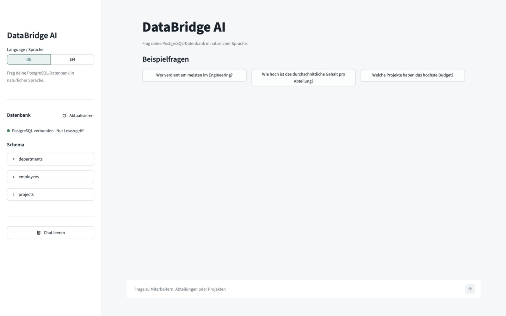
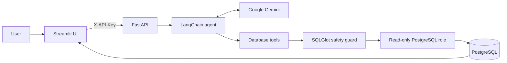

# DataBridge AI

DataBridge AI is a local, read-only natural-language interface for PostgreSQL. It
turns questions in English or German into SQL, executes the query through a
restricted database role, and presents the verified result as an answer, table,
chart, downloadable CSV, and inspectable SQL.



## Capabilities

- Natural-language database questions in English and German
- Schema explorer with columns, primary keys, and foreign keys
- Agentic table discovery, schema inspection, and query execution
- Structured results with tables, automatic charts, CSV export, and SQL details
- SQLGlot-based single-statement, read-only query validation
- Bounded result sets, statement timeouts, and a database role limited to `SELECT`
- Constant-time API token validation and per-token request limiting
- Docker Compose setup with health checks and an optional pgAdmin profile
- FastAPI OpenAPI documentation at `http://localhost:8000/docs`

## Architecture



The included database contains synthetic departments, employees, and projects so
the full workflow is usable immediately.

## Requirements

- Docker Desktop with Docker Compose
- A Google API key with access to the configured Gemini model

## Quick Start

1. Create the local configuration file:

   ```bash
   cp .env.example .env
   ```

2. Set `GOOGLE_API_KEY` in `.env`. Replace every other `replace_me` value with a
   unique random value. Generate suitable values with:

   ```bash
   openssl rand -hex 32
   ```

3. Build and start the application:

   ```bash
   docker compose up -d --build
   ```

4. Open `http://localhost:8501`.

Check service status or stop the application with:

```bash
docker compose ps
docker compose down
```

Existing database volumes keep their original credentials. After changing a
database password, synchronize the roles with:

```bash
./scripts/sync_db_roles.sh
```

To recreate only the included synthetic database from scratch:

```bash
docker compose down --volumes
docker compose up -d --build
```

This deletes the local PostgreSQL volume and all data stored in it.

## API

The browser UI is the primary interface. The backend can also be called directly:

```bash
curl --request POST http://localhost:8000/api/v1/query \
  --header "Content-Type: application/json" \
  --header "X-API-Key: $APP_SECRET_TOKEN" \
  --data '{"question":"What is the average salary by department?","language":"en"}'
```

Responses include the natural-language answer, every executed SQL statement,
structured rows, truncation state, and timing information. Schema metadata is
available from `GET /api/v1/schema` with the same API key.

## Development

Create a virtual environment and install the pinned development dependencies:

```bash
python3.11 -m venv .venv
source .venv/bin/activate
python -m pip install --requirement requirements-dev.txt
```

Run all local checks:

```bash
ruff check .
ruff format --check .
python -m compileall -q agent.py app.py config.py csv_export.py database.py \
  main.py query_log.py rate_limit.py result_formatting.py schema_service.py \
  sql_safety.py sql_tools.py tests
pytest -q
docker compose config --quiet
```

Tests use isolated SQLite databases and mocked agents, so they do not call Gemini
or require PostgreSQL.

## Security Model

DataBridge AI uses several independent controls:

1. The backend accepts one authenticated request token and compares it in constant
   time.
2. SQL is parsed as PostgreSQL and must contain exactly one read-only query.
3. The agent database role has `SELECT` privileges, read-only transactions, and
   short server-side timeouts.
4. Query output is capped before it is returned to the agent or UI.
5. Services bind to `127.0.0.1` by default, and containers run as non-root users
   where applicable.

Questions, relevant schema metadata, generated SQL, and returned rows are sent to
the configured model provider while answering a request. Review data-handling
requirements before connecting a database containing confidential information.

The API token is service-to-service protection for local use, not a multi-user
identity system. Do not expose this stack directly to the internet. Add TLS,
user authentication, durable distributed rate limiting, audit controls, and a
managed secrets solution before any networked deployment.

See [SECURITY.md](SECURITY.md) for reporting guidance and additional safeguards.

## Optional pgAdmin

Set `PGADMIN_DEFAULT_PASSWORD` to a unique value, then start the profile:

```bash
docker compose --profile admin up -d pgadmin
```

Open `http://localhost:5050`. PostgreSQL is reachable from pgAdmin at host
`postgres`, port `5432`.

## License

Licensed under the [MIT License](LICENSE).
